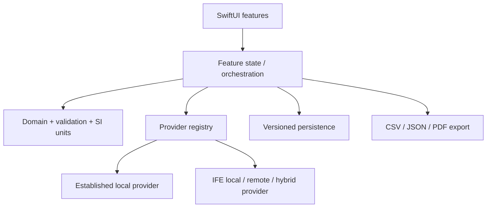

# Architecture

## Boundaries

`PhaseXpert` is the SwiftUI presentation target. `PhaseXpertCore` is a local
Swift package containing domain models, unit conversion, validation, provider
contracts and the versioned remote contract. The package has no UI dependency.



The calculator, provider registry and local saved-case store are implemented.
Export remains an explicit extension point.

## Concurrency

Providers are `Sendable` and expose asynchronous, throwing functions.
Implementations must check cancellation before and during iterative work.
Remote clients conform to `IFEAPIClient`, allowing deterministic test doubles.
UI state is main-actor isolated.

## Data flow

1. The UI accepts bar absolute and °C, then converts them to Pa and K through
   the centralized unit layer.
2. `CalculationValidator` validates finite values, composition, provider
   coverage and the provider domain.
3. Normalization is a separate, explicit user action. Original input remains
   available for provenance.
4. The registry resolves the selected provider by stable identifier.
5. The provider returns status-bearing values and solver metadata.
6. `CalculationRecord` combines the request, response, original display
   values, SI values, normalization history, app build and embedded provider
   descriptor. Results, persistence and exports consume this immutable record
   rather than querying the current provider registry for historical metadata.

## Result traceability

The calculator creates a `CalculationRecord` only after a provider returns.
The record retains the exact model descriptor supplied with that response,
including versions, calculation mode, coefficient/library version, method,
limitations and references. This prevents historical results from silently
adopting metadata from a later provider release.

Original pressure and temperature are retained as bar absolute and degrees
Celsius alongside Pa and K. Original mol% entries are retained separately from
the normalized mole-fraction array whenever the user explicitly applies
normalization. Presentation may convert dynamic viscosity from Pa·s to mPa·s,
but the provider value and unit remain unchanged in the record.

## Directory structure

```text
PhaseXpert/
├── PhaseXpert.xcodeproj
├── PhaseXpert/                 SwiftUI application
│   ├── App/
│   ├── DesignSystem/
│   ├── Features/
│   └── Resources/
├── PhaseXpertCore/             Local Swift package
│   ├── Sources/PhaseXpertCore/
│   │   ├── API/
│   │   ├── Domain/
│   │   ├── Providers/
│   │   ├── Units/
│   │   └── Validation/
│   └── Tests/
├── PhaseXpertTests/
├── PhaseXpertUITests/
└── Documentation/
```

## Persistence plan

SwiftData uses `PhaseXpertSchemaV1` and `PhaseXpertMigrationPlan` from the first
stored release. `SavedCalculation` keeps searchable, sortable index fields and
an encoded immutable `CalculationRecord`. The payload has its own format
version so unsupported future payloads fail visibly instead of being
misinterpreted.

Duplicate and metadata-edit operations do not change the embedded calculation.
“Edit inputs and rerun” loads the recorded SI operating point and calculated
composition into the calculator, uses the currently installed provider, and
creates a new result without overwriting the original. The store is local-only:
CloudKit is disabled and no saved-case data leaves the device.

## Comparison

Saved-case comparison is derived from two immutable `CalculationRecord`
snapshots and is not persisted as a new scientific result. One record is the
reference and the displayed difference is always `compared − reference`.
Pressure differences are shown in bar and temperature differences in °C.
Dynamic viscosity is converted from internal Pa·s to mPa·s before comparison.

A property difference is available only when both records contain finite,
calculated values with a common display unit. Unsupported, failed, extrapolated
or unit-incompatible values remain visibly non-comparable. The interface calls
these values differences—not errors or deviations—and explicitly states that
the comparison does not establish model accuracy.

## Design system

Asset colors were sampled from the supplied IFE template. The supplied English
IFE logo is used as an unmodified vector. Apple system typography is used
because the template font cannot be assumed redistributable; Dynamic Type and
VoiceOver are therefore supported without bundling a font licence.
