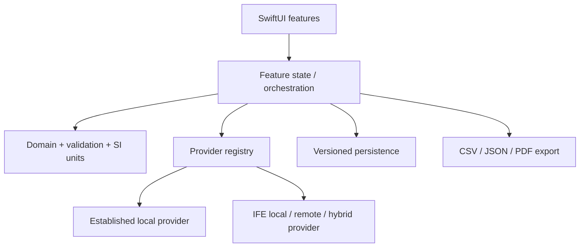

# Architecture

## Boundaries

`PhaseXpert` is the SwiftUI presentation target. `PhaseXpertCore` is a local
Swift package containing domain models, unit conversion, validation, provider
contracts and the versioned remote contract. The package has no UI dependency.



Only the first four boxes are scaffolded in this milestone. Persistence and
export remain explicit extension points.

## Concurrency

Providers are `Sendable` and expose asynchronous, throwing functions.
Implementations must check cancellation before and during iterative work.
Remote clients conform to `IFEAPIClient`, allowing deterministic test doubles.
UI state is main-actor isolated.

## Data flow

1. The UI accepts bar absolute and °C, then converts them to Pa and K through
   the centralized unit layer.
2. `CalculationValidator` validates finite values, composition, provider
   coverage and the provider domain.
3. Normalization is a separate, explicit user action. Original input remains
   available for provenance.
4. The registry resolves the selected provider by stable identifier.
5. The provider returns status-bearing values and solver metadata.
6. A future immutable saved-result snapshot will retain request, response,
   display units, app build and provider provenance.

## Directory structure

```text
PhaseXpert/
├── PhaseXpert.xcodeproj
├── PhaseXpert/                 SwiftUI application
│   ├── App/
│   ├── DesignSystem/
│   ├── Features/
│   └── Resources/
├── PhaseXpertCore/             Local Swift package
│   ├── Sources/PhaseXpertCore/
│   │   ├── API/
│   │   ├── Domain/
│   │   ├── Providers/
│   │   ├── Units/
│   │   └── Validation/
│   └── Tests/
├── PhaseXpertTests/
├── PhaseXpertUITests/
└── Documentation/
```

## Persistence plan

Use SwiftData with an explicit schema version. Persist a case definition and
an immutable calculation snapshot separately. Store enums and provider payloads
using stable string identifiers; do not persist Swift type names. Before the
first schema ships, add migration tests for at least one synthetic prior
schema. Remote calculations are opt-in and the request preview must disclose
exactly what leaves the device.

## Design system

Asset colors were sampled from the supplied IFE template. The supplied English
IFE logo is used as an unmodified vector. Apple system typography is used
because the template font cannot be assumed redistributable; Dynamic Type and
VoiceOver are therefore supported without bundling a font licence.
